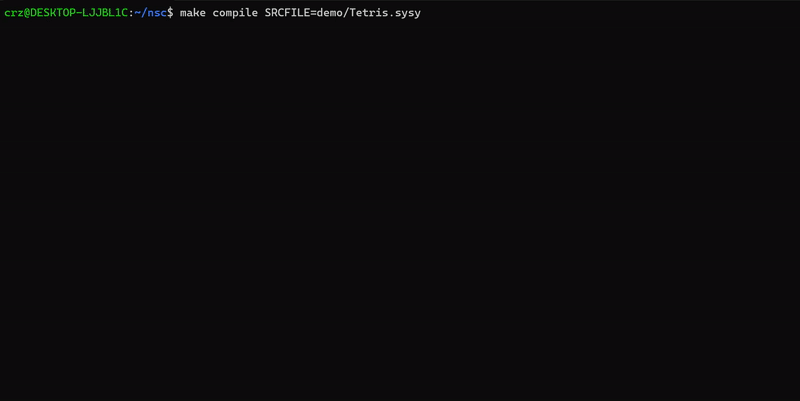

#   NSC项目简介
NSC(**N**aive **S**ysY **C**ollection),将SysY编译成riscv并运行，主要包括compiler和os两部分，compiler负责将SysY源码生成riscv代码，os负责模拟计算机系统的运行。

##  项目结构
```bash
.
├── compiler/                 # 编译器核心模块
│   ├── src/                 # Java源代码
│   │   ├── Main.java        # 程序入口
│   │   ├── SysYLexer.g4     # ANTLR词法规则
│   │   ├── SysYParser.g4    # ANTLR语法规则
│   │   ├── SemanticVisitor.java    # 语义分析
│   │   ├── IRGenerationVisitor.java # IR生成
│   │   ├── LLVMIROptimization.java  # IR优化
│   │   ├── LLVMIRToRiscv.java      # RISC-V代码生成
│   │   ├── RegisterAllocator.java  # 寄存器分配+指针分析
│   │   └── FormatterVisitor.java  # 代码格式化
│   └── utils/               # 第三方工具库
│   
├── tests/                   # 测试用例
│   ├── develop_test/        # 开发测试用例
│   ├── IR_generate_test/    # IR生成测试
│   ├── IR_optimize_test/    # IR优化测试
│   ├── parser_test/         # 语法分析测试
│   └── semantic_test/       # 语义分析测试
├── os/                     # 模拟操作系统
│   ├── include/            # 头文件目录
│   │   ├── os.h            #模拟操作系统
│   │   ├── process.h       #模拟进程
│   │   ├── syscall.h       #模拟系统调用
│   │   └── console.h       #模拟终端库(方便俄罗斯方块实现) 
│   └── *.cpp               # C++源文件
├── demo/                   # 演示程序
│   ├── quicksort.sysy      # 快速排序示例
│   ├── Tetris.sysy         # 俄罗斯方块示例
│   └── test_concurrent1.sysy  # 并发示例
├── Makefile               # 项目构建文件
├── tests.sh              # 自动化测试脚本
└── README.md            # 项目说明文档
```
## 项目运行方式
在Linux系统上运行，需要Java和GCC环境
```bash
make compile SRCFILE=demo/Tetris.sysy
make run_os
clear
./nos demo/Tetris.riscv
#-------------------------------------------------------------
make compile SRCFILE=demo/quicksort.sysy
make run_os
./nos demo/quicksort.riscv
#-------------------------------------------------------------
make compile SRCFILE=demo/test_concurrent1.sysy
make compile SRCFILE=demo/test_concurrent2.sysy
make run_os
./nos demo/test_concurrent1.riscv demo/test_concurrent2.riscv
#-------------------------------------------------------------
```
分别输入以上命令完成demo的运行，其中Tetris是俄罗斯方块小游戏；quicksort是快速排序；test_concurrent1和test_concurrent2是模拟操作系统并行处理的样例
***

```bash
make compile SRCFILE=path/to/input/file.sysy [ARGS=""]
make run_os
./nos path/to/input/file.riscv [path/to/input/file2.riscv.....]
#    []内为可选参数
```
通过以上命令运行某一个sysy文件,其中加入```ARGS="-l"```表明保留生成的.ll文件；```ARGS="-c"```表明用格式化后的代码覆盖源文件。

./nos 后面为文件路径，其中多个路径表示多个程序并行
***
```bash
./tests.sh [-f path/to/specific/test/file]
```
通过以上命令运行tests.sh中SYSY_DIR下的测试用例，加入-f参数可选某一个特定的用例
***

## 编译器简介
源自于NJU软院编译原理作业，在此基础之上实现了函数调用(包括递归,数组作为参数等)、数组的实现，同时在中端与后端加入多重优化，可以编译出俄罗斯方块、快速排序等有关算法的实现。前端通过ANTLR构建语法树，中间代码采用LLVM-IR，目标代码为riscv
### 编译器实现
#### 编译器前端
采用ANTLR构建语法分析树,并进行了词法、语法、语义的分析，其中词法，语法在Main.java中实现，语义分析在SemanticVisitor.java中遍历语法树实现。在语义分析时，构建了符号表，具体实现在symbolTable.java。
#### 中间代码生成
在IRGenerationVisitor.java通过遍历语法树实现。
#### 中间代码优化
实现了常量传播算法、未使用变量消除，死代码消除等优化，同时通过对数组(指针)进行简单的别名分析(包括may_analysis和must_analysis)，实现对GETELEMTPTR指令的优化。
#### 目标代码生成
采用图染色法进行寄存器分配，由于加入了数组，LLVMIR访问数组时用的是GETELEMTPTR指令，所以会出现不同指针指向相同变量的情况，因此在图染色法时还需要进行别名分析。通过指针分析、活跃变量分析完成图染色法寄存器分配之后，根据中间代码生成riscv文件。
## 模拟操作系统简介
是NJU ICS PA的极度简化版，核心行为是随机选取一个进程，取指令，执行，遇到系统调用/需要外设操作的指令则在syscall.h/console.h找到对应的函数执行，同时在每次随机选取进程时保存上下文。


